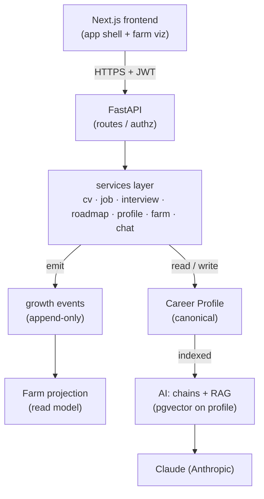
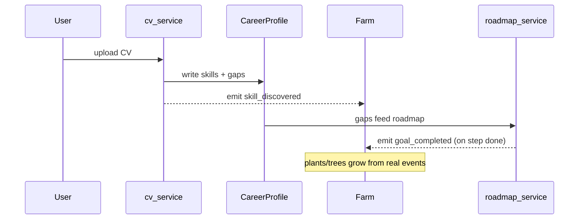

# Architecture

Authoritative, current view of how CareerFarm is structured. For the original design rationale see [specs/2026-07-23-careerfarm-architecture.md](superpowers/specs/2026-07-23-careerfarm-architecture.md).

## Product in one line

An AI career-growth platform where a user's professional profile is the single source of truth. Every feature (CV analysis, job matching, interview prep, roadmap, chat) reads from and writes back to that profile, and progress is visualized as a living "farm." The differentiator is integration: features feed each other rather than acting as silos.

## Layers

- **Frontend** (`frontend/`) — Next.js App Router UI. Talks to the backend over HTTPS, attaching the Supabase JWT.
- **API** (`backend/app/api`) — FastAPI routers; verifies auth, delegates to services.
- **Services** (planned, `backend/app/services`) — feature business logic. The only place features touch each other's data — through the shared profile, not direct calls.
- **AI** (planned, `backend/app/chains` + `rag`) — LangChain chains and pgvector RAG, hidden behind the services layer. Routes never import LangChain.
- **Data** — Supabase Postgres + pgvector.

## The spine (how features integrate)

One canonical `CareerProfile` per user. Features read and write it, and emit **growth events**. The **Farm is a projection** computed from skills + goals + events — never its own source of truth. This is why the farm always reflects real progress.

End-to-end example:

## Core data model (planned)

Built at sub-project 2 (Career Profile + Farm spine). Not yet implemented.

- `users` — Supabase auth
- `career_profiles` — 1:1; canonical skills summary, experience, education, target role, level/XP
- `skills` — name, category, mastery, source → plants/trees
- `goals` — target, status, progress → growth points
- `growth_events` — append-only (type, payload, ts) → farm reads this
- `cv_analyses`, `job_matches`, `interview_sessions`, `roadmaps` — per-feature records, FK to profile
- `chat_messages` — conversation history
- `documents` + `embeddings` (pgvector) — RAG corpus

## Build status

Original plan sequenced the frontend at step 4; it was **brought forward** to a scaffold early (frontend is owned separately). Current state:

| # | Sub-project | Status |
|---|-------------|--------|
| 1 | Foundation (backend bootstrap) | ✅ Done |
| — | Frontend scaffold (app shell) | ✅ Done (brought forward) |
| 2 | Career Profile + Farm spine | ⬜ Not started |
| 3 | CV Studio (first AI feature) | ⬜ Not started |
| 4 | Dashboard + Farm viz (real data) | ⬜ Stub UI only |
| 5 | Roadmap | ⬜ Stub UI only |
| 6 | Job Match | ⬜ Stub UI only |
| 7 | Interview Coach | ⬜ Stub UI only |
| 8 | Career Chat | ⬜ Stub UI only |

**Deferred:** LLM module (arrives with CV Studio), deployment (leaning Vercel + Railway), live `alembic upgrade head` (needs a provisioned Supabase DB).

## Stack

| Layer | Choice |
|-------|--------|
| Frontend | Next.js 16 · React 19 · TypeScript · Tailwind v4 · shadcn/ui |
| API | FastAPI · Python 3.11 · managed with uv |
| Data / Auth | Supabase Postgres + pgvector · Supabase Auth (JWT verified in the API) |
| AI | Claude (Anthropic), behind the services layer |

See [decisions.md](decisions.md) for why each was chosen.
