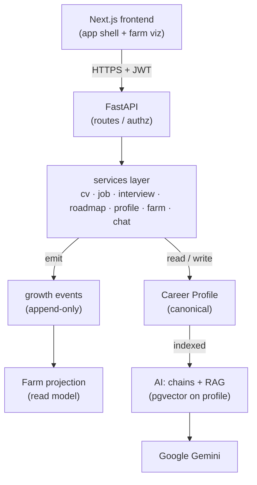
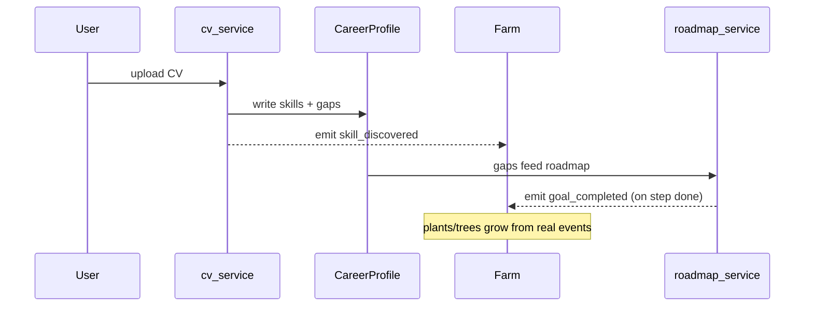

# Architecture

Authoritative, current view of how CareerFarm is structured. For the original design rationale see [specs/2026-07-23-careerfarm-architecture.md](superpowers/specs/2026-07-23-careerfarm-architecture.md).

## Product in one line

An AI career-growth platform where a user's professional profile is the single source of truth. Every feature (CV analysis, job matching, interview prep, roadmap, chat) reads from and writes back to that profile, and progress is visualized as a living "farm." The differentiator is integration: features feed each other rather than acting as silos.

## Layers

```mermaid
flowchart TD
    FE["Next.js frontend<br/>(app shell + farm viz)"]
    API["FastAPI<br/>(routes / authz)"]
    SVC["services layer<br/>cv · job · interview · roadmap · profile · farm · chat"]
    PROFILE["Career Profile<br/>(canonical)"]
    EVENTS["growth events<br/>(append-only)"]
    FARM["Farm projection<br/>(read model)"]
    AI["AI: chains + RAG<br/>(pgvector on profile)"]
    GEMINI["Google Gemini"]

    FE -->|"HTTPS + JWT"| API
    API --> SVC
    SVC -->|read / write| PROFILE
    SVC -->|emit| EVENTS
    EVENTS --> FARM
    PROFILE -->|indexed| AI
    AI --> GEMINI
```

- **Frontend** (`frontend/`) — Next.js App Router UI. Talks to the backend over HTTPS, attaching the Supabase JWT.
- **API** (`backend/app/api`) — FastAPI routers; verifies auth, delegates to services.
- **Services** (`backend/app/services`) — feature business logic. The only place features touch each other's data — through the shared profile, not direct calls.
- **AI** (`backend/app/ai`) — LangChain chains and pgvector RAG, hidden behind the services layer. Routes never import LangChain.
- **Data** — Supabase Postgres + pgvector.

## The spine (how features integrate)

One canonical `CareerProfile` per user. Features read and write it, and emit **growth events**. The **Farm is a projection** computed from skills + goals + events — never its own source of truth. This is why the farm always reflects real progress.

End-to-end example:

```mermaid
sequenceDiagram
    participant U as User
    participant CV as cv_service
    participant P as CareerProfile
    participant F as Farm
    participant R as roadmap_service
    U->>CV: upload CV
    CV->>P: write skills + gaps
    CV-->>F: emit skill_discovered
    P->>R: gaps feed roadmap
    R-->>F: emit goal_completed (on step done)
    Note over F: plants/trees grow from real events
```

## Core data model

Shipped in Phase 1 (`backend/app/models/`):

- `career_profiles` — canonical per user (`user_id` = Supabase `auth.users.id`, not an FK: that table is in another schema). Holds identity, target role, `cv_text`, and the denormalised `level`/`xp`/`streak_days` cache.
- `skills` — name, category, mastery, source → plants/trees. Unique per profile on `lower(name)`, so "Python" and "python" are one plant.
- `goals` — title, status, progress → growth points.
- `growth_events` — append-only (type, payload, xp_awarded, ts). The farm reads this. Individual events are never updated or deleted; the whole log cascades away with its profile.
- `ai_usage` — one row per (profile, day, feature). Backs the daily AI quota.

RLS is enabled on every table with **no permissive policy**. The backend connects as a role that bypasses RLS, so authorization lives in the service layer (every method filters on `profile_id`); deny-by-default exists so the browser's public `anon` key can read nothing if it leaks.

Still planned, per phase:

- `cv_analyses` — **shipped** (phase 3). `job_matches`, `skill_gap_analyses`, `resume_optimizations` — phase 4
- `roadmaps` + `roadmap_steps` — phase 5
- `interview_sessions` + `interview_turns` — phase 6
- `chat_messages`, `documents` + `document_chunks` (pgvector, HNSW) — **shipped** (phase 7)

## Build status

Original plan sequenced the frontend at step 4; it was **brought forward** to a scaffold early (frontend is owned separately). Current state:

| # | Sub-project | Status |
|---|-------------|--------|
| 1 | Foundation (backend bootstrap) | ✅ Done |
| — | Frontend: full static UI (all 7 features + auth, mock data, design system) | ✅ Done (brought forward) |
| 2 | Career Profile + Farm spine (backend) | ✅ Done. Models, migrations (applied to Supabase), RLS, services, `/profile` API, quota, structured logging, security headers, rate limiting. 91 tests. |
| 3 | CV Studio (AI + wiring frontend to API) | ✅ Done. ai/ folded into backend/app/ai/; upload -> Gemini -> profile + skills + growth events. |
| 4 | Dashboard + Farm viz (real data) | ✅ Done (phase 5). Farm is a pure read model over skills, goals, and the event log. |
| 5 | Roadmap | ✅ Done (phase 5). Steps persist; completing one emits `goal_completed` and grows the farm. |
| 6 | Job Match · Skill Gap · Resume Optimizer | ✅ Done (phase 4). All three read CV text from the profile, never the request. |
| 7 | Interview Coach | ✅ Done (phase 6). Stateful multi-turn; history rebuilt server-side, never accepted from the client. |
| 8 | Career Chat | ✅ Done (phase 7). pgvector RAG; retrieval filtered by profile in SQL, not after top-k. |

Every page now reads from the real API. The mock data layer has been deleted.

**Deferred:** deployment only (Vercel + Railway, phase 8). The Supabase project is provisioned and migrated through `0008_rag`.

## Stack

| Layer | Choice |
|-------|--------|
| Frontend | Next.js 16 · React 19 · TypeScript · Tailwind v4 · shadcn/ui |
| API | FastAPI · Python 3.11 · managed with uv |
| Data / Auth | Supabase Postgres + pgvector · Supabase Auth (JWT verified in the API) |
| AI | Google Gemini via LangChain, behind the services layer |

See [decisions.md](decisions.md) for why each was chosen.
